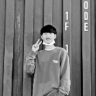

---

<!-- fontColor=A3DCBE //초록색 -->

TEST

<svg xmlns="http://www.w3.org/2000/svg" xmlns:xlink="http://www.w3.org/1999/xlink" style="z-index:1;position:relative" width="854" height="222" viewBox="0 0 854 222">
                
                <g transform="translate(427, 111) scale(1, 1) translate(-427, -111)">
                    
                                
                                <path d="" fill="#black" opacity="0.4" transform="scale (-1, 1)" transform-origin="center">
                <animate attributeName="d" dur="20s" repeatCount="indefinite" keyTimes="0;0.333;0.667;1" calcmod="spline" keySplines="0.2 0 0.2 1;0.2 0 0.2 1;0.2 0 0.2 1" begin="0s" values="M0 0L 0 142Q 213.5 182 427 152T 854 177L 854 0 Z;M0 0L 0 167Q 213.5 182 427 162T 854 152L 854 0 Z;M0 0L 0 187Q 213.5 157 427 187T 854 152L 854 0 Z;M0 0L 0 142Q 213.5 182 427 152T 854 177L 854 0 Z"></animate>
            </path>
            <path d="" fill="#black" opacity="0.4" transform="scale (-1, 1)" transform-origin="center">
                <animate attributeName="d" dur="20s" repeatCount="indefinite" keyTimes="0;0.333;0.667;1" calcmod="spline" keySplines="0.2 0 0.2 1;0.2 0 0.2 1;0.2 0 0.2 1" begin="-10s" values="M0 0L 0 157Q 213.5 202 427 172T 854 182L 854 0 Z;M0 0L 0 172Q 213.5 142 427 142T 854 162L 854 0 Z;M0 0L 0 167Q 213.5 147 427 172T 854 187L 854 0 Z;M0 0L 0 157Q 213.5 202 427 172T 854 182L 854 0 Z"></animate>
            </path>
                </g>
                
                        <text text-anchor="middle" alignment-baseline="middle" x="50%" y="50%" class="text" style="fill:#ffffff;">日八冂斤</text>
                 
            </svg>

TEST

김은행

MAJOR : ECONOMICS

INHA UNIVERSITY

100, Inha-ro, Michuhol-gu, Incheon, Republic of Korea

  

<!-- https://github.com/badges/shields -->

<!--  -->

<!-- http://commitcombo.com/maker -->
<!--  -->

<!-- https://readmeplants.com/maker?name=Devxb&planet=yellowMoon&plant=blossomTree&nameTag=blackNameTag&ground=hill&background=black -->
<!--   -->

<!-- https://github.com/mazassumnida/mazacofo -->
<!--  -->

<!-- https://github.com/anuraghazra/github-readme-stats -->
<!--  -->

  

<!-- https://github.com/ryo-ma/github-profile-trophy -->
<!--  -->

## Personal Data

---

> 2001.08.17 대한민국 출생

> Email : kimeunhang@inha.edu

> Github : <a href="https://github.com/kimbank">https://github.com/kimbank</a>

## Education

---

> 2008 ~ 2012
>
> **두레학교** _경기도 구리시_

> 2012 ~ 2013
>
> **동곡초등학교** _경기도 남양주시_

> 2014 ~ 2016
>
> **동화중학교** _경기도 남양주시_

<!-- > 
2014 ~ 2016

>
> 
> 
동화중학교
 -->

> 2017 ~ 2017
>
> **동화고등학교** _경기도 남양주시_

> 2017 ~ 2019
>
> **백양고등학교** _경기도 고양시_

> 2021 ~
>
> **인하대학교** _인천광역시_

<!-- //** 원 작성자의 샘플 **//

## Research Interest

---

- Computer Vision

  - image Object Detection
  - Vot
  - Semantic/Instance Segmentation
  - Super Resolution

- Machine Learning / Deep Learning
  - GAN
  - Few-Shot Learning
  - Meta Learning

## Project

---

- **Visual Object Tracking Using Plenoptic Image Sequences**

과학기술정보통신부-한성대 프로젝트 : 학부생 인턴

Lightfield 영상에서의 Siamease Network를 이용한 단일 객체 추적

- **FPV Swlf-driving RC Car**

VR 헤드셋을 통해 FPV 카메라에서 보내는 실시간 영상을 받으며 일반인들에게 조금더 쉽고 안전하게 자율주행을 체험해보는 프로젝트 수행

- **Anti Drone AI Robot using object detection**

SSD를 활용한 드론 탐지프로그램으로 라즈베리파이와 3D프린터를 이용해 만든 로봇이 드론을 인식하고 pan and tilt모터 체계를 이용하여 드론 트래킹

- **AI Mashroom Classificator App**

mobileNet을 이용한 classification으로 버섯을 구별해주는 인공지능 버섯 도감 어플로서 독버섯 채취 및 섭취 방지를 위한 어플

## Awards

---

<u><strong><a href="https://www.youtube.com/watch?v=-ofj2vTvH0Q/">\*\*The 15th HANSUNG Engineering Competitive Exhibition[PM] 2019 </a></strong></u>

- BRONZE PRIZE, SPONSOR PRIZE

<u><strong><a href="https://www.youtube.com/watch?v=5rFu7Kv_DfY&t=362s">\*\*HANSUNG UNIVERSICY C&C FESTIVAL[PM] 2020</a></strong></u>

- BRONZE PRIZE

<a herf="https://www.youtube.com/watch?v=Mn9Dx5xukcg&t=10s"><u><strong>\*\*The 16th HANSUNG Engineering Competitive Exhibition[PM] 2020</strong></u></a>

- SILVER PRIZE , - BRONZE PRIZE

<a herf="https://www.youtube.com/watch?v=ah9MZQ0PjMI&t=60s"><u><strong>2020년 공개SW 개발자 대회(주최:과학기술정보통신부, 주관:정보통신산업진흥원) [PM] 2020</strong></u></a>

<a herf="https://blog.naver.com/khw11044/222152408161">BRONZE PRIZE</a>

## Work Experiences

---

-2020. 07 – 2020. 11 Visual Object Tracking Using Plenoptic Image Sequences,

Hansung Univ – ETRI

<a herf="https://github.com/khw11044/PlenOpticVot_Siamfc_2020">https://github.com/khw11044/PlenOpticVot_Siamfc_2020</a> -->

<!-- ## Skills and Certification

---

-Language : C++ _beginner_ -->

<!-- ## Patents

---

None -->
