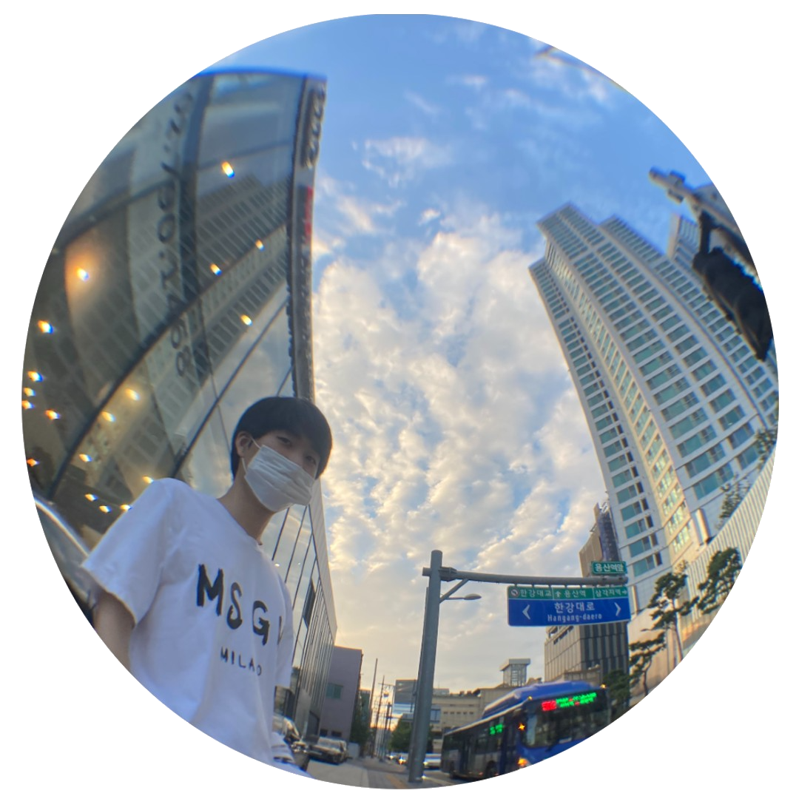

---

<!--  -->
<!-- fontColor=A3DCBE //초록색 -->

<!--  -->

<!--  -->

김은행

MAJOR : ECONOMICS

INHA UNIVERSITY

100, Inha-ro, Michuhol-gu, Incheon, Republic of Korea

  

<a>

<!-- https://github.com/badges/shields -->

<!--  -->

<!-- http://commitcombo.com/maker -->
<!--  -->

<!-- https://readmeplants.com/maker?name=Devxb&planet=yellowMoon&plant=blossomTree&nameTag=blackNameTag&ground=hill&background=black -->
<!--   -->

<!-- https://github.com/mazassumnida/mazacofo -->
<!--  -->

<!-- https://github.com/anuraghazra/github-readme-stats -->
<!--  -->

  

<!-- https://github.com/ryo-ma/github-profile-trophy -->
<!--  -->

## Personal Data

---

> Birth : [2001.08.17](https://en.wikipedia.org/wiki/2001#Births)

> Email : <a href="mailto:kimeunhang@inha.edu">kimeunhang@inha.edu</a>

> Github : <a href="https://github.com/kimbank">https://github.com/kimbank</a>

  

## Education

---
<!-- 
> 2008 ~ 2012
>
> **두레학교** _경기도 구리시_

> 2012 ~ 2013
>
> **동곡초등학교** _경기도 남양주시_

> 2014 ~ 2016
>
> **동화중학교** _경기도 남양주시_

> 2017 ~ 2017
>
> **동화고등학교** _경기도 남양주시_

> 2017 ~ 2019
>
> **백양고등학교** _경기도 고양시_ -->

> 2021 ~
>
> **인하대학교** _인천광역시_